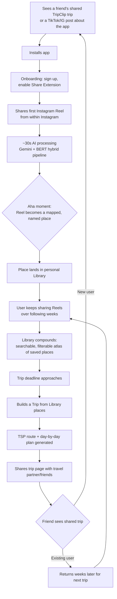
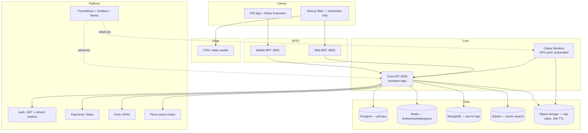
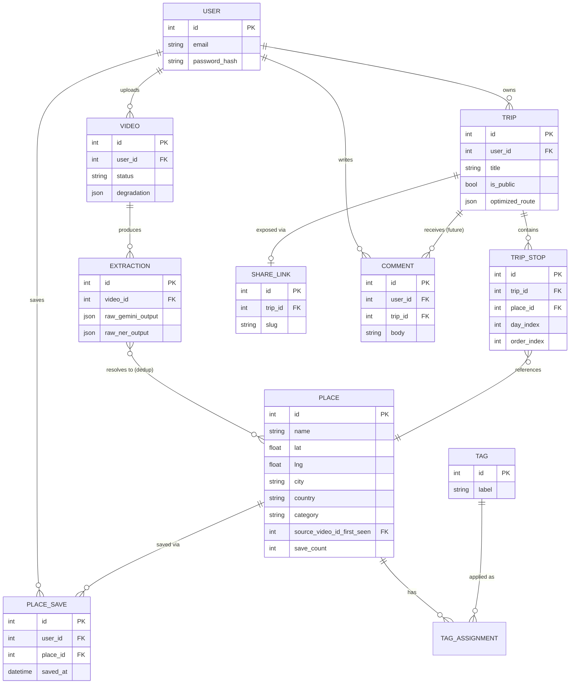

# TripClip AI — Product Strategy

**Prepared as:** founding-team strategy document (PM + Staff Eng + AI Eng + UX + Architecture)
**Prepared for:** Süleyman Sardoğan, solo founder/engineer
**Date:** 2026-08-06
**Status:** living document — audit of an existing build, not a from-scratch plan

---

## How to read this

This is an **audit-and-evolve** document, not a blank-slate pitch. Every recommendation is checked against what's actually in the repo today (verified 2026-08-06):

- The AI pipeline (Gemini multimodal + BERT NER hybrid, Nominatim geocoding, Haversine dedup, TSP route optimization, Qdrant RAG tips) is real, working, and tuned — this is the product's actual moat. Protect it.
- Video upload is **iOS-only** (Share Extension → Mobile BFF). Web upload is explicitly deprecated as of 2026-07-22 — a product decision, not a bug.
- The data model is `Video → one Plan`. A video's `deduplicated_locations` is a JSON blob living *inside a single video row*. There is **no first-class `Place` entity** shared across videos. This is the single biggest structural gap between the current build and the pitch ("save destinations, not videos") — the app currently saves *videos-as-plans*, not a durable cross-video place collection. This gap shows up repeatedly below (Phase 6, 7, 12).
- A public-feed / shareable-plan primitive already exists (`Plan.is_public`, `/explore`, `/share/[id]` with QR code). This is an underused growth loop, not something to build from zero.
- Team size is **one person**. Every phase below — especially Phase 13 and 18 — is scoped for a solo founder, not a funded 8-person team, even though the analysis is written at startup rigor.

**Assumptions made explicit (see also §Open Questions):**
- A1: "Pay" in this doc means willingness to pay a consumer subscription or transact affiliate revenue — not enterprise/B2B in year one.
- A2: Android is out of scope for v1 given iOS-only capture; this is treated as a real risk (Phase 16), not ignored.
- A3: Instagram/TikTok ToS tolerance for yt-dlp-based extraction continues at roughly current levels; a ToS clampdown is modeled as a risk, not baked into the roadmap as guaranteed-safe.
- A4: "Academic project" framing (Fırat University) is treated as a GTM asset, not a constraint on ambition.

---

## Phase 1 — The Problem

### What problem are we actually solving?
People discover travel-worthy places through short-form video (Reels/TikToks) faster than any tool exists to capture them usefully. The save action is one tap; turning 200 saved videos into an actual trip is hours of rewatching, manual note-taking, and re-typing place names into Google Maps.

### Why is this painful?
| Pain | Detail |
|---|---|
| **Capture ≠ structure** | Instagram/TikTok "save" stores a *video*, not a *place*. No name, no coordinates, no category survives the save action. |
| **Rewatch tax** | At planning time, users re-watch dozens of saved Reels to extract what the video was even about. |
| **No map, no memory** | Saved videos live in a scrolling list, not a map or searchable index. You cannot ask "what did I save in Rome?" |
| **Content rot** | Creators delete videos/accounts; saved Reels silently die, taking the place info with them. |
| **The aspiration graveyard** | Because the save is nearly free (one tap) but retrieval is expensive, saves accumulate and are almost never converted into an actual visited place. |

### Why do current solutions fail?
- **Social platforms (IG/TikTok saves, Pinterest):** excellent capture, zero structure. Optimized for content re-consumption, not travel planning.
- **Planning tools (Wanderlog, TripIt, Roadtrippers, Notion):** excellent structure, zero capture. They assume the user already knows the place name and will type it in manually.
- **Google Maps Lists:** structured and mappable, but capture still requires manual search-and-add per place; nothing bridges from video.

No existing tool sits at the **capture → structure boundary**. That gap is the entire opportunity.

### Who suffers most?
People who (a) actively save 10+ travel-related short-form videos per week, and (b) plan 2+ real trips per year. High save-volume + real travel intent = high pain + high willingness to pay. Passive scrollers with no near-term trip have the pain but not the urgency to pay.

### Who will pay?
The person **currently planning a trip with a departure date**, not the passive saver. Willingness to pay is triggered by an approaching deadline, not by save volume alone — this matters for monetization timing (Phase 14) and for the "aha moment" definition (Phase 5).

### Why now?
- Short-form video has become a primary place-discovery channel for the 18–34 cohort, ahead of traditional search/review sites for many travel decisions.
- Multimodal LLMs (Gemini 2.5-class models) now make **cheap, accurate, structured extraction from video+audio+on-screen text** viable at consumer-app cost — this was not economically realistic two to three years ago. TripClip's Gemini + BERT NER hybrid pipeline (measured ~89% location recall vs. ~72% Gemini-only, per the repo's own pipeline notes) is a direct product of this timing window, not a coincidence.

---

## Phase 2 — Market Research

| Competitor | Strength | Weakness | Opportunity for TripClip |
|---|---|---|---|
| **Instagram Collections** | Zero-friction save, huge existing save volume | No structure, no map, no search by place, content can vanish | Be the place video saves *should* have gone to |
| **TikTok Favorites** | Same save-volume strength | Same as above, even less structure than IG | Same |
| **Google Maps Lists** | Map-native, structured, shareable | Manual entry only — no capture from video/social | Auto-populate Maps-style lists *from* video |
| **Wanderlog** | Strong manual trip-planning UX, collaborative | Capture is 100% manual; you must already know place names | Feed Wanderlog-quality planning with automatic capture |
| **Polarsteps** | Beautiful trip *journaling* (retrospective), social feed | Backward-looking (logs a trip already taken), not a discovery/planning tool | TripClip is forward-looking: pre-trip discovery → planning |
| **Notion** | Infinitely flexible, DB + doc hybrid | Zero travel-specific structure, zero AI extraction, high setup effort | Own the "I don't want to build my own Notion travel DB" segment |
| **Pinterest** | Best-in-class visual discovery/save | Not video-native for Reels-style content, no geocoding/map | Video-native equivalent of a Pinterest board, but mappable |
| **Tripsy** | Clean itinerary + reservation tracker | No capture layer at all — pure organizer | Feed it, or displace it, with capture-native trips |
| **TripIt** | Best-in-class booking-confirmation parsing (forwarded emails) | Only handles *booked* trips, not discovery-phase saves | Different lifecycle stage — TripClip owns pre-booking, could integrate/hand off to TripIt-style tools |
| **Roadtrippers** | Strong for road-trip route planning + POI discovery | US-road-trip-centric, manual POI search | Different modality (video vs. search-driven POI discovery) |
| **AI travel chat startups** (general — Mindtrip/Layla/Vacay-class) | LLM-native itinerary generation from a text prompt | Itinerary is generated *from imagination*, not from places the user actually discovered and wants to go to | TripClip's itineraries are grounded in specific videos the user has already decided are worth visiting — provenance and personal intent, not generic AI suggestions |

### How TripClip AI becomes 10x better
The single differentiator no competitor above occupies: **automatic video → structured, geocoded, deduplicated place extraction, at the moment of save.** Every competitor is either capture-native-but-structure-blind (social platforms) or structure-native-but-capture-blind (planning tools). TripClip's Gemini+BERT hybrid pipeline is the only thing on this list that does both. This is not a feature — it is the whole company. Every roadmap decision should be evaluated against "does this protect or exploit the capture→structure wedge."

---

## Phase 3 — Ideal Customer Profile (ICP)

| Segment | Save-Reels behavior | Trip frequency | Verdict |
|---|---|---|---|
| Casual travelers | Medium | 1–2/yr | Secondary |
| **Reel-saving trip planners** (see below) | **High (10+/wk)** | **2–4/yr** | **PRIMARY** |
| Digital nomads | Low (they're already there, not discovering) | Continuous but different JTBD (logistics, not discovery) | Poor fit |
| Backpackers | Low-medium; budget/route tools (Wanderlog/TripIt) already serve long-haul planning better | High but low willingness to pay | Poor fit |
| Food lovers | High save behavior, restaurant-specific | Frequent local + travel | Strong secondary — see MVP category tagging |
| Solo travelers | Medium | Varies | Secondary |
| Couples | High — Reels are heavily consumed/saved as a *shared* activity | 2–3/yr | Strong secondary, key to virality (Phase 5) |
| Content creators | Very high save volume, but their JTBD is *distribution*, not personal trip-planning | N/A | Wrong product — do not build for them in v1 |
| Luxury travelers | Low-medium save-from-video behavior; use concierge/TA channels | Frequent | Poor fit for v1 |
| Business travelers | Near-zero — discovery isn't the job | Frequent | Poor fit |

### Primary ICP: The Reel-Saving Trip Planner
**Definition:** 22–34, saves 10+ travel-related short-form videos per week across Instagram/TikTok, plans 2–4 real trips per year (often with a partner or friend group), currently manages saves via native "Saved" folders and screenshots.

**Why this one, over the others:**
1. **Save volume × trip frequency is the product's core leverage point** — value compounds with save volume (Phase 5 retention loop) and monetizes at trip frequency (Phase 1 "who pays"). No other segment has both at once.
2. Creators and luxury/business travelers have adjacent but *different* products they actually need (distribution tools, concierge services) — building for them dilutes the wedge.
3. Couples/friend-group planning inside this ICP is the natural on-ramp to the sharing/virality loop (Phase 5) — the shared-plan primitive already exists in the codebase (`is_public`, `/share/[id]`), so this ICP choice is buildable *today*, not aspirational.

---

## Phase 4 — Product Vision

**Mission:** Turn scrolling into traveling.

**Vision:** Become the default place-memory layer that sits between social discovery and travel booking — the thing every "save" from a travel Reel should have gone to in the first place.

**North Star Metric:** **Places Converted to Itinerary Stops per Active User per Month.**
Not raw save count (that just reproduces the Instagram graveyard the product exists to fix), not raw video count (a vanity metric that rewards hoarding). This metric only moves when a saved place is actually pulled into a trip — i.e., when the product delivers on its actual promise. See Phase 17 for the full metrics tree underneath it.

**Core Value Proposition:** "Never lose a place you found on social media — and actually go there."

**Brand personality:** Warm, low-friction, quietly confident. Not enterprise-AI-hype, not gimmicky. The tone of a well-organized friend who already visited the place, not a chatbot.

**Emotional experience:** Relief (the graveyard of saved videos finally has a home) → delight (watching a Reel become a pin on a map in ~30 seconds) → pride (sharing a beautiful, personally-curated trip page with friends).

---

## Phase 5 — Product Strategy

### The ONE thing TripClip AI must become famous for
"The app that turns your Instagram Saves into a real trip." Own this sentence in the market before anyone else does — it is a category name, not a feature description.

### The aha moment
Share a Reel to TripClip → **~30 seconds later** (this is the current measured Gemini-mode pipeline latency, not a future promise) it appears as a named, categorized, mapped pin with extracted context. This aha moment **already exists in the shipped pipeline**. The strategic priority is not to build it — it's to (a) never let latency regress, and (b) make sure the very first thing a new user does after install is experience it, unblocked by any friction (see Phase 9).

### What keeps users coming back
The **compounding personal atlas**: each new saved Reel adds to a growing, searchable map of everywhere the user has ever wanted to go, structured by city and category. Value is a function of *cumulative* saves, not any single session — same mechanic that makes Pinterest boards sticky, but map-native and trip-actionable. This requires the Phase 12 data model change (a first-class cross-video `Place`) — without it, retention has a ceiling, because today's "one video = one plan" model doesn't let saves compound into a single browsable collection.

### Retention strategy
- Pre-trip nudges driven by the atlas itself: "You've saved 12 places in Rome — build a trip?"
- Re-engagement anchored to real travel dates (if the user has ever entered one), not generic push spam.

### Virality strategy
The shareable trip page (already shipped: `is_public` plan + `/share/[id]` + QR code) is the growth loop, not a side feature. A friend who views a beautifully laid-out shared trip is, by definition, inside the Phase 3 ICP (someone who consumes travel content and has friends who travel). Double down here before building anything net-new social.

### Network effects
Weak by default (mostly single-player utility, like Wanderlog). The genuine multiplayer opportunity is **collaborative trip building for couples/friend groups** — a "you + your travel partner adding Reels to the same trip" mode. This is a should-have, not an MVP requirement (Phase 6), but it's the highest-leverage post-MVP feature because it converts the ICP's natural behavior (saving as a shared activity, per Phase 3) directly into a network effect.

---

## Phase 6 — Feature Audit

Every feature considered, with disposition and why. ✅ = already shipped per current repo state.

### Must Have (MVP-blocking)
| Feature | Why | Status |
|---|---|---|
| Video/URL → AI place extraction | The entire wedge (Phase 2) | ✅ shipped (Gemini + hybrid) |
| Cross-video **Place library** (search/filter by city, category) | Without this, the product is "video-to-plan converter," not "save destinations" — the literal pitch is unmet without it | ❌ **not built** — biggest gap |
| Route optimization (TSP) into a day-by-day plan | Converts a place list into something usable on the ground | ✅ shipped |
| iOS Share Extension capture | Zero-friction save, the entire UX promise depends on this being frictionless | ✅ shipped |
| Shareable trip page | Core growth loop (Phase 5) | ✅ shipped (`/share/[id]`) |
| Processing status/progress | User must trust the ~30s wait isn't broken | ✅ shipped (Redis progress + polling) |
| Graceful AI degradation (partial results > failure) | Users must never see the app appear "broken" when one ML stage fails | ✅ shipped |

### Should Have (post-MVP, high leverage)
| Feature | Why |
|---|---|
| Category/tag auto-classification (restaurant, cafe, viewpoint, hidden gem) | Enables the food-lovers secondary ICP and makes the library filterable, not just searchable |
| Collaborative trip building (multi-user) | Network-effect wedge (Phase 5) |
| Push notifications for processing complete/failed | Reduces the "did it work?" anxiety loop; iOS TODO already flagged in codebase |
| Semantic library search (embeddings via existing Qdrant infra) | Qdrant is already deployed for RAG tips — reusing it for "find that beach cafe I saved" search is low-incremental-cost |
| Affiliate booking links attached to Place records | Direct monetization path once Place is first-class (Phase 14) |

### Could Have (nice, not urgent)
| Feature | Why deprioritized |
|---|---|
| Budget tracking per trip | `Plan.budget` field exists but is unused product surface; real budget tools (Splitwise-class) already do this better |
| Offline map download | iOS already has CoreData offline cache for *data*; full offline map tiles is a large lift for unclear demand |
| Web-based trip editing | Explicitly deprioritized — web upload already killed by product decision; web's job is sharing/viewing, not authoring |

### Later (real ideas, wrong sequencing)
| Feature | Why later |
|---|---|
| Android app | Real demand exists but doubles platform surface area for a solo founder before PMF is proven on iOS |
| Public creator/follower graph | Premature — no evidence yet that users want a social graph vs. just sharing individual trips |
| B2B/API for travel agencies or DMOs | Needs a proven consumer base first; see Phase 14 |
| Multi-language extraction beyond Turkish/English | Expand once the primary market is validated |

### Delete
| Feature | Why |
|---|---|
| Web video/URL upload flow (`web/src/app/upload`, `web-bff` upload routes) | Already a stated product decision (2026-07-22) — mobile-only capture is the correct call, since capture *must* be zero-friction and the Share Extension is the zero-friction path; web upload was a redundant, higher-friction second path. Formally remove the dead route/page rather than leaving it live-but-unlinked. |
| `Plan.budget` as a bare unused JSON blob | Either build it into a real feature (trip cost estimate) or remove it — half-built schema surface with no UI is a maintenance liability, not optionality |

---

## Phase 7 — MVP Design

The MVP is **not** a rebuild — it's the current pipeline plus the one structural gap from Phase 6 closed. Five screens, each justified:

| Screen | Job | Why it must exist |
|---|---|---|
| **Share-in (iOS Share Sheet)** | Zero-friction capture | This *is* the product's entire acquisition and retention hook — if this has friction, nothing else matters |
| **Processing** | Show the ~30s aha moment happening | Without visible progress, users abandon before the payoff (Phase 9) |
| **Library** *(net-new)* | Browse/search/filter every place ever extracted, across all videos, by city/category | This is the missing piece that makes the pitch literally true — "save destinations, not videos" |
| **Trip Builder** | Select a subset of Library places → auto-route → day-by-day plan | Converts passive collection into active travel utility (ties to North Star metric) |
| **Trip View / Share** | View a finished plan on a map, share publicly | Growth loop (Phase 5); already shipped, keep as-is |

Every other current screen (login/signup, dashboard, settings) is necessary infrastructure, not differentiated product — keep minimal, don't invest design effort beyond functional.

---

## Phase 8 — User Journey

**Loyalty loop:** H → I → J → K → M → O is the retention engine; M → N → A is the growth engine. Both depend on the Library existing as a real, compounding surface (Phase 6/12 gap).

---

## Phase 9 — UX Review: Friction Points

| Friction point | Where users quit/confuse | Fix |
|---|---|---|
| No visible collection concept | User shares 5 Reels, has no way to see them together as one thing — feels like the app "did nothing" beyond the single most recent trip | Library screen (Phase 7) |
| iOS-only | Any Android-using half of a couple/friend group can't participate | Named as a real risk, not silently accepted (Phase 16) |
| Processing wait, even at ~30s | Any wait without feedback reads as broken on a first-time share | Already mitigated via progress polling — keep, don't regress |
| "One video = one plan" mental model | Contradicts the pitch language ("collection") the moment a user shares a second video and doesn't see it merge with the first | This is the #1 UX bug-by-omission — root-caused to the data model gap (Phase 12), not a UI polish issue |
| Silent error swallowing on explore/landing stats (`.catch(() => {})`) | Minor — acceptable for non-critical supplementary stats, already reviewed and deliberately left as-is | No action needed |
| Cognitive load of budget/timeline fields with no clear payoff | `Plan.budget`/`timeline` exist in schema but aren't a clear user-facing value — adds surface without payoff | Resolve per Phase 6 (build it out or cut it) |

**Reducing cognitive load, generally:** the Library + Trip Builder split (browse without commitment, then commit to a subset for a specific trip) mirrors how Pinterest boards → actual purchase decisions work, and how Wanderlog's own manual-entry flow works — proven pattern, not a novel UX bet.

---

## Phase 10 — AI Strategy

| AI technique | Use it? | Where | Why |
|---|---|---|---|
| **LLM (Gemini multimodal)** | Yes — core | Video/audio/OCR → structured place extraction | Already the product's moat; do not replace |
| **Vision models (YOLO, Google Vision)** | Yes — supporting | Object/landmark detection as ensemble signal | Improves recall in non-Gemini/hybrid mode; keep as fallback layer |
| **OCR (RapidOCR)** | Yes — supporting | On-screen text (menu boards, street signs, captions) | High-precision signal for named POIs |
| **Speech-to-text (Whisper)** | Yes — supporting, hybrid mode only | Feeds BERT NER for the ensemble | Gemini-only mode already bypasses it for speed — correct tradeoff, keep |
| **NER (Turkish BERT)** | Yes — core to the hybrid advantage | Cross-validates Gemini's extractions | This is the measured +17pp recall lever (~72%→~89%) — the single most defensible technical claim in the product; protect and keep tuning it |
| **Embeddings + Qdrant** | Yes — expand usage | Currently RAG-only (travel tips); extend to power Library semantic search ("that rooftop bar in Lisbon") | Infra already paid for — reusing it for search is close to free incremental cost |
| **RAG** | Yes — keep | Travel tips generation | Already shipped, works |
| **Knowledge graph** | No, not yet | — | No evidence of a use case that a Place table + tags + embeddings can't already serve; premature complexity |
| **Recommendation engine** | Later, lightweight | "Since you saved X in Rome, here's Y" | Valuable but needs Place-level data (Phase 12) and real usage volume to be non-generic first |
| **Agentic AI (autonomous multi-step planning)** | No, explicitly avoid for v1 | — | High hallucination surface area for a travel app where wrong info (wrong opening hours, a closed restaurant) has real-world cost to the user's trip; the product's credibility depends on *grounded* extraction, not generative invention |
| **Memory (long-term user preference learning)** | Later | Personalize route optimization, ranking | Needs volume of Trip Builder usage first |

### Where AI should NOT be used
- **Never auto-book or auto-pay** — keep the human in the loop for any transaction; AI's job is discovery/structuring, not commerce execution.
- **Never fabricate operational details** (hours, prices, whether a place still exists) without a verifiable source — this is a specific, real hallucination risk for an LLM-multimodal pipeline and should be treated as a trust/safety issue, not a quality nice-to-have (see Phase 16).
- **Don't let AI silently override user edits** — the existing `stop_order` design (user reordering persists, raw AI output is never mutated) is the right pattern; keep it as the model for all future user-editable AI output.

---

## Phase 11 — Architecture

Current architecture (BFF pattern: iOS/Web → Mobile-BFF/Web-BFF → Core-API → Postgres/Redis/Mongo/Qdrant + Celery) is sound and documented in `CLAUDE.md` — it is not being redesigned. What follows is the delta needed to go from "working academic-grade deployment" to "product that scales past a few hundred users."

| Decision | Why |
|---|---|
| Keep BFF pattern | Already correct — iOS needs flat/lean JSON, web needs different shapes; don't collapse into one API |
| Object storage (S3-class) for raw video, still deleted at 24h | Formalizes the "roadmap item" already noted in the repo (`Pre-signed URL upload`) — matches the existing KVKK/GDPR data-minimization design (raw video already deleted in 24h per current docs) |
| GPU worker pool, autoscaled (KEDA/Kubernetes-class) | Already the repo's own stated next step; Celery queue depth is the natural autoscale signal |
| Self-hosted or paid-tier Nominatim | Public Nominatim rate limits are already flagged as a known constraint (~85% cache hit rate today masks but doesn't remove this ceiling) |
| Dedicated Place search index (Postgres full-text initially; Meilisearch/Elastic only if scale demands) | Needed for the Phase 7 Library screen; start with Postgres FTS — don't add a new datastore before the query patterns justify it |
| Payments via Stripe | Standard, avoid building billing infra |
| Push via APNs | iOS-only matches current platform reality; the token-registration TODO already exists in the codebase — closing it is Phase 6 "should have" |
| Observability: Prometheus + Sentry + Grafana | Already deployed per prior audit — no change, just keep instrumenting new surfaces (Library, Trip Builder) |
| CI/CD: GitHub Actions | Already exists — extend coverage as new services are added, don't replace |

### Security & cost notes
- Auth boundary (BFF validates JWT, Core-API `/internal/*` is internal-network-only) is correct — keep.
- Cost optimization: Gemini calls are the dominant marginal cost per video — the existing `DAILY_UPLOAD_QUOTA_PER_USER` (Redis-backed, fail-open) is the right lever; extend it to a paid-tier quota multiplier once subscriptions exist (Phase 14), rather than building separate rate-limit infra.

---

## Phase 12 — Data Model

The single most important schema change this document recommends: **promote `Place` to a first-class, cross-video entity.** Today, `Video.deduplicated_locations` is a JSON blob scoped to one video — there is no row a second video's extraction can join against, so two Reels of the same restaurant become two disconnected blobs instead of one enriched Place. That's the literal cause of the Phase 6/9 "one video = one plan" gap.

**Migration note (not a rewrite):** `Video`, `Plan`→`Trip`, and the auth tables already exist and are sound — this is an *additive* migration (new `Place`, `PlaceSave`, `TripStop`, `Tag` tables + a backfill job that parses existing `deduplicated_locations` JSON into `Place` rows), not a schema replacement. `Plan.locations`/`Plan.timeline` become derived/materialized views over `TripStop` rather than the source of truth.

---

## Phase 13 — Roadmap

| Stage | Scope | Exit criteria |
|---|---|---|
| **MVP** | Place entity + Library screen + Trip Builder on top of existing pipeline; kill dead web-upload code | A user can share 5+ Reels and see them as one searchable collection, then build a trip from a subset |
| **Beta** (TestFlight, closed) | 20–50 real users from Phase 3 ICP; push notifications; category tagging | Places-converted-to-itinerary-stops metric is measurable and non-zero across multiple users |
| **v1** (public launch) | Public TestFlight/App Store, shareable-trip growth loop instrumented, semantic Library search via Qdrant | Organic installs attributable to shared-trip views (Phase 5 virality loop working) |
| **v2** | Collaborative trip building (couples/friend groups), affiliate booking links on Place records, subscription paywall | First $ in affiliate/subscription revenue |
| **v3** | Android app, recommendation engine, expanded language support | Cross-platform parity for the ICP's friend groups |
| **Enterprise/Future** | B2B API for travel content creators/DMOs to auto-generate place collections from their own content libraries | Only after consumer PMF is unambiguous — do not pull this forward |

---

## Phase 14 — Monetization

| Model | Fit | Notes |
|---|---|---|
| **Freemium subscription** | Primary | Free tier: capped saves/trips per month (reuses existing `DAILY_UPLOAD_QUOTA_PER_USER` mechanism). Paid: unlimited saves, collaborative trips, priority processing. |
| **Affiliate (hotels/tours/experiences via Place records)** | Primary, once Place is first-class | Booking.com/GetYourGuide-style affiliate links attached at the Place level — high fit because Places already carry name+coordinates, the exact join key affiliate APIs need |
| **Affiliate (flights)** | Secondary | Lower margin, more integration complexity — not a v1 priority |
| **Ads** | Avoid | Actively hurts the brand promise ("your travel memory, organized") — a cluttered, ad-laden save tool recreates the exact problem (noise over signal) TripClip exists to fix |
| **B2B / API** | Later (Phase 13 "Enterprise") | Real path (content creators, DMOs) but requires consumer volume/credibility first; premature now |
| **Creator tools** | Later | Only once there's a reason for creators to want structured output of their own content — not a v1/v2 need |

**Realistic revenue path:** subscription is the primary, controllable lever (direct correlation to the North Star metric — heavy users of the Library/Trip Builder are the ones who hit free-tier caps). Affiliate is the secondary, more volatile lever, dependent on partner integration effort and conversion rates outside TripClip's control. Do not model affiliate revenue as load-bearing before v2.

---

## Phase 15 — Go-To-Market

| Channel | Approach | Why |
|---|---|---|
| **TikTok/Instagram organic** | Screen-recorded demo of the actual aha moment: paste a Reel link → ~30s → mapped result | The product's own demo *is* native short-form content — meta-fit with the ICP's platform of choice |
| **Travel micro-influencer seeding** | Give the app to creators whose *audience* saves their content obsessively (not the creators-as-users segment from Phase 3, which is deprioritized — creators are a distribution channel here, not a user segment) | Their followers are exactly the Phase 3 ICP |
| **Product Hunt launch** | Standard launch-day push at v1 | Reaches early-adopter tech audience, useful for initial signal, not primary growth |
| **Reddit (r/travel, r/solotravel, r/digitalnomad)** | Organic posts framed as "I built a tool to fix my own saved-Reels graveyard" | Authentic founder story resonates better here than marketing copy |
| **University ambassador angle** | Lean into the Fırat University academic origin explicitly — "built as a university project, now a real product" is a genuinely differentiated, credible founder story | Turns an academic constraint into a GTM asset, not something to hide |
| **SEO** | Low priority for v1 | Discovery-intent search traffic doesn't match the product's actual acquisition mechanism (social virality, Phase 5) — don't invest here before the growth loop is proven |
| **Communities (travel Discord/FB groups)** | Secondary, opportunistic | Lower effort than building, worth light seeding post-launch |

### Growth loop (the actual engine)
Shared trip page (already shipped) → viewed by a friend in the ICP → install → first share → aha moment → own trip → own share. This is Phase 5's virality strategy operationalized; GTM spend should go toward *seeding the first shares*, not generic ads, since the loop is what compounds.

---

## Phase 16 — Risks

| Risk | Severity | Mitigation / current status |
|---|---|---|
| **Instagram/TikTok ToS enforcement against yt-dlp-based extraction** | High | Already a known constraint (`YT_DLP_COOKIES`, permanent-vs-transient failure classification exist in the pipeline). No structural fix exists — this is a standing platform-dependency risk, not one that can be engineered away. Diversify capture (Share Extension passes native video bytes when possible, reducing scrape dependency) where feasible. |
| **Copyright of extracted/reprocessed video content** | Medium | Product only extracts *structured place data*, discards raw video within 24h (per existing data-minimization design) — meaningfully reduces exposure vs. a product that rehosts video |
| **Gemini/LLM hallucination on place details** (wrong hours, closed venues, invented prices) | High | Named explicitly in Phase 10 as a hard AI-strategy boundary; needs a "confidence/verify" affordance in the Library UI (e.g., surfacing "AI-extracted, unverified" for operational details) before those details are trusted for booking-adjacent decisions |
| **Geocoding rate limits (Nominatim public tier)** | Medium | Already a documented roadmap item; ~85% cache hit rate buys time but self-hosting is needed before meaningful scale |
| **Scaling AI/GPU cost** | Medium | Per-user daily quota already exists as the cost control; needs a paid-tier variant (Phase 14) |
| **Abuse (spam uploads, quota circumvention)** | Low-Medium | Existing quota system is fail-open by design (availability over strict enforcement) — acceptable at current scale, revisit if abuse is observed |
| **Competition** (a well-funded entrant builds the same wedge) | Medium | The hybrid Gemini+BERT recall advantage and the existing shipped pipeline are a real head start, but not a moat forever — speed of shipping the Library/Place model (Phase 6/12) matters because it's the differentiator competitors are least likely to have (video extraction is now table-stakes-buildable; the "save destinations" collection UX is not yet, per Phase 2's landscape scan) |
| **Security** | Low (already substantially addressed) | Prior audit (2026-07-22/23) closed most critical gaps — rate limiting, PII log scrubbing, migration locking, upload size caps. Re-audit before any payments integration (Phase 14) specifically. |
| **GDPR/KVKK** | Low (already substantially addressed) | Right-to-erasure cascade delete and audit trail already exist per prior work — extend the same pattern to any new `Place`/`PlaceSave` tables in the Phase 12 migration, don't treat it as separately solved |
| **iOS-only platform risk** | Medium | Explicit product decision, correctly scoped for a solo founder (Phase 3), but excludes any Android-using half of a couple/friend group — directly limits the Phase 5 virality loop's addressable surface. Revisit at v3, not before. |
| **Solo-founder bus-factor / execution capacity** | High, and honest | One person building, shipping, and supporting a production consumer app with an ML pipeline is a real constraint on roadmap pace — Phase 18 is scoped accordingly rather than assuming team-of-8 velocity |

---

## Phase 17 — Metrics

| Category | Metric | Why it matters |
|---|---|---|
| **North Star** | Places converted to itinerary stops / active user / month | Only metric that reflects the actual promise being delivered (Phase 4) |
| Activation | % of new users who share ≥1 Reel within 24h of install | Tests whether the zero-friction capture promise holds |
| Activation | Time from Share Extension tap → result visible | Must stay near current ~30s baseline; regression here kills the aha moment |
| Retention | W1/W4 retention of users who hit the aha moment at least once | Isolates whether the product retains *after* the demo works, not just whether onboarding works |
| Engagement | Median saved places per active user (Library size) | Leading indicator for the compounding-atlas retention thesis (Phase 5) |
| Engagement | DAU/WAU/MAU | Standard, but interpret alongside save cadence — this product is not necessarily daily-use |
| Conversion | Trips created per month per active user | Bridges Library engagement → North Star |
| Growth | Shared trip page views → installs (loop conversion rate) | Directly measures the Phase 5/15 growth loop |
| Growth | K-factor (installs per existing user per month via shared trips) | Tells you if the loop is actually compounding or just linear |
| Monetization | Free-to-paid conversion rate at quota cap | Tests whether the freemium cap is correctly positioned |
| Monetization | LTV / CAC | Standard, but CAC should stay near-zero if the organic/virality channels (Phase 15) are working as designed — a rising paid-CAC dependency would be a strategy failure signal |
| Quality | AI degradation rate per video (already logged) | Existing signal — should gate any pipeline change before rollout |
| Quality | NPS | Standard qualitative health check, run post-beta |
| Session | Session length, sessions/week | Secondary — this is a utility app, not an attention app; don't over-optimize for time-on-app |

---

## Phase 18 — Execution Plan (6 months, solo founder)

Scoped honestly for one person, not a funded team. Weeks are illustrative pacing, not hard deadlines.

| Weeks | Focus | Deliverable | Depends on |
|---|---|---|---|
| 1–2 | Data model migration | `Place`, `PlaceSave`, `Tag`, `TripStop` tables + backfill job from existing `deduplicated_locations` JSON | Phase 12 design |
| 3–5 | Library screen (iOS) | Browse/search/filter all extracted places across all videos | Weeks 1–2 |
| 6–7 | Trip Builder screen | Select Library subset → route optimize → day plan (reuses existing TSP optimizer) | Weeks 3–5 |
| 8 | Remove dead web-upload surfaces | Delete `web/src/app/upload`, unused BFF upload routes | Independent — can run in parallel with any week above |
| 9–10 | Category/tag auto-classification | Extend Gemini/NER pipeline output to assign `Tag` rows | Weeks 1–2 |
| 11 | Push notifications (close existing TODO) | APNs token registration + processing-complete/failed pushes | Independent |
| 12–14 | Closed TestFlight beta | 20–50 real Phase-3-ICP users recruited via personal network + one Reddit/community post | Weeks 3–10 |
| 15–16 | Beta feedback triage | Fix top friction points surfaced by real usage (expect Library/Trip Builder UX gaps not visible from spec alone) | Week 12–14 results |
| 17–18 | Semantic Library search via Qdrant | Reuse existing vector infra for "find that place" search | Weeks 3–5 |
| 19–20 | Shared-trip growth instrumentation | Track shared-page view → install attribution (Phase 17 growth metrics) | Existing `/share/[id]` |
| 21–22 | Public App Store launch prep | Store listing, demo content (Phase 15), TestFlight → public | Weeks 12–16 stable |
| 23–24 | Launch + GTM push | TikTok/IG demo content, Reddit/community posts, Product Hunt | Week 21–22 |

**Success criteria at month 6:** North Star metric is non-zero and trending across a real (if small) user base; at least one organic install is attributable to a shared trip page (growth loop validated, not just assumed).

**Explicit non-goals for this 6-month window:** Android, payments/subscriptions, collaborative multi-user trips, B2B/API. All correctly sequenced into Phase 13's v2/v3/Enterprise stages — pulling any of them forward risks the solo-founder capacity risk named in Phase 16.

---

## Open Questions

- Does the founder want TripClip framed publicly as an academic project turned product (GTM asset, Phase 15) or a standalone startup with the academic origin downplayed? Changes the launch narrative materially.
- Is there budget/appetite for a self-hosted Nominatim instance before the public-tier rate limit becomes a hard blocker, or should this wait for a concrete incident?
- What's the actual current save/share volume in production (if any real users exist yet beyond the founder)? This document's ICP and retention assumptions should be checked against real save-cadence data as soon as it exists.
- Is a TestFlight beta cohort already identifiable (friends/classmates who fit the Phase 3 ICP), or does recruitment need to start from zero?

## TODO
- [ ] Validate the Phase 1 "why now" claim (short-form video overtaking search for place discovery) against any first-party analytics once real usage data exists — currently an industry-directional claim, not a measured one for this product specifically.
- [ ] Design the Phase 12 migration/backfill script for existing `deduplicated_locations` JSON → `Place` rows (data engineering task, not covered by this strategy doc).
- [ ] Decide the free-tier cap number for Phase 14 freemium (needs real usage distribution data first — don't guess a number pre-beta).
- [ ] Write the actual App Store / TestFlight listing copy once Phase 15's narrative decision (above) is made.
